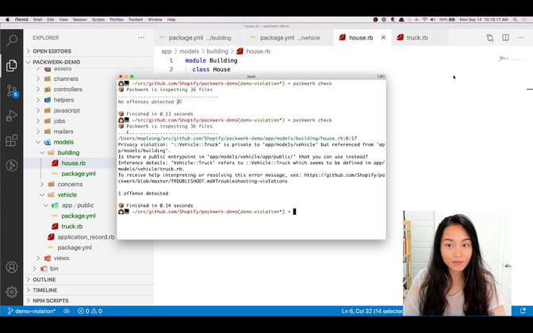

# Packwerk [](https://github.com/Shopify/packwerk/actions?query=workflow%3ACI)

### ⚠️ While Shopify is actively using `packwerk`, we consider it feature complete.
We are keeping `packwerk` compatible with current versions of Ruby and Rails, but will accept feature requests only in rare cases. Please submit bug fixes though!

---

> "I know who you are and because of that I know what you do."
> This knowledge is a dependency that raises the cost of change.

-- _Sandi Metz, Practical Object-Oriented Design in Ruby_

Packwerk is a Ruby gem used to enforce boundaries and modularize Rails applications.

Packwerk can be used to:
* Combine groups of files into packages
* Define package-level constant visibility (i.e. have publicly accessible constants)
* Help existing codebases to become more modular without obstructing development

## Prerequisites

Packwerk needs [Zeitwerk](https://github.com/fxn/zeitwerk) enabled, which comes with Rails 6.

Packwerk supports MRI versions 2.6 and above.

## Demo

Watch a [1-minute video demo](https://www.youtube.com/watch?v=NwqlyBAxVpQ&feature=youtu.be) on how Packwerk works.

[](https://www.youtube.com/watch?v=NwqlyBAxVpQ&feature=youtu.be)

## Installation

1. Add this line to your application's Gemfile:

```ruby
gem 'packwerk'
```

2. Install the gem

Execute:

    $ bundle install

Or install it yourself as:

    $ gem install packwerk

2. Run `bundle binstub packwerk` to generate the binstub
3. Run `bin/packwerk init` to generate the configuration files

## Usage

Read [USAGE.md](USAGE.md) for usage once Packwerk is installed on your project.

## Pronunciation

"Packwerk" is pronounced [[ˈpakvɛʁk]](https://cdn.shopify.com/s/files/1/0258/7469/files/packwerk.mp3).

## Ecosystem

Various third parties have built tooling on top of packwerk. Here's a selection of some that might prove useful:

- https://github.com/bellroy/graphwerk draws a graph of your package dependencies
- https://github.com/Gusto/packwerk-vscode integrates packwerk into Visual Studio Code so you can see violations right in your editor
- https://github.com/Gusto/stimpack sets up Rails autoloading, as well as `rspec` and `FactoryBot` integration, for packages arranged in a flat list. Stimpack is quite convenient, but for autoloading we recommend to use `Rails::Engine`s instead.
- https://github.com/rubyatscale/danger-packwerk integrates packwerk with [danger.systems](https://danger.systems) to provide packwerk feedback as Github inline PR comments
- https://github.com/rubyatscale/packwerk-extensions contains extensions for packwerk, including a checker for packwerk that allows you to enforce public API boundaries. This was originally extracted from `packwerk` itself.

## Development

After checking out the repo, run `bin/setup` to install dependencies. Then, run `rake test` to run the tests. You can also run `bin/console` for an interactive prompt that will allow you to experiment.

## Limitations

With Ruby being a very dynamic language, static analysis tools such as Packwerk are bound to have limitations.
To reduce the impact of those limitations, Packwerk is designed to avoid false positives (reporting references as violations that are actually fine) at any cost, and we pay the cost by accepting a small number of false negatives (failing to report actual violations).

- Packwerk can only resolve references to constants that are defined in code loaded by the application's Zeitwerk autoloader.
  This is because we rely on [Zeitwerk's conventions](https://github.com/fxn/zeitwerk#file-structure), and code that is loaded differently (like through an explicit `require`) often doesn't follow these conventions.
- Method calls and objects passed around the application are completely ignored. Packwerk only cares about static constant references. That said, if you want Packwerk to analyze parameters of a method, you can use [Sorbet](https://sorbet.org/) to define a type signature. Sorbet signatures are pure Ruby code and use constants to express types, and Packwerk understands that.
- Support for custom Zeitwerk configuration is limited. If [custom ActiveSupport inflections](https://guides.rubyonrails.org/autoloading_and_reloading_constants.html#customizing-inflections) are used, Packwerk will understand that and everything is fine. However, if Zeitwerk is directly configured with [custom Zeitwerk inflections](https://github.com/fxn/zeitwerk#inflection) or to [collapse directories](https://github.com/fxn/zeitwerk#collapsing-directories), _Packwerk will get confused and produce false positives_.

## Contributing

Bug reports and pull requests are welcome on GitHub at https://github.com/Shopify/packwerk.

Read and follow the guidelines in [CONTRIBUTING.md](https://github.com/Shopify/packwerk/blob/main/CONTRIBUTING.md).

## License

The gem is available as open source under the terms of the [MIT License](https://opensource.org/licenses/MIT).
