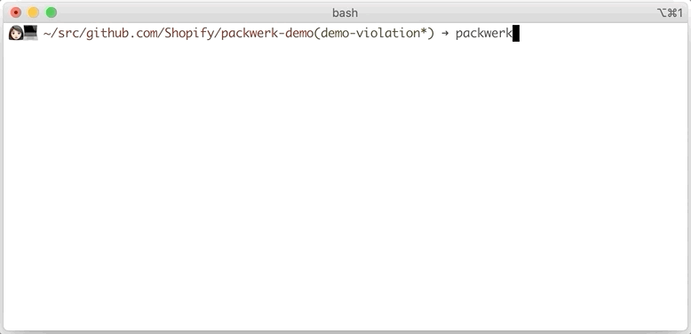

# Troubleshoot

* [Troubleshooting violations](#Troubleshooting-violations)
  * [Feedback loop](#Feedback-loop)
  * [Package Dependency violation](#Package-Dependency-violation)
    * [Interpreting Dependency violation](#Interpreting-Dependency-violation)

## Troubleshooting violations

### Feedback loop
Packwerk can give feedback via continuous integration (CI) if you have it set up, but that is a long feedback cycle. If you want faster feedback, use Packwerk on the command line locally.

You can specify folders or packages in Packwerk commands for a shorter run time:

     bin/packwerk check components/your_package

_Note: You cannot specify folders or packages for `bin/packwerk validate` and `bin/packwerk update-todo` because the 
command runs for the entire application._

### Package Dependency violation
A constant defined in a package A is referenced from a package B that doesn’t define a dependency on A. Packages define their dependencies in their `package.yml`.

See: [USAGE.md - Enforcing dependency boundary](USAGE.md#Enforcing-dependency-boundary)

#### Interpreting Dependency violation

> /Users/JaneDoe/src/github.com/sample-project/billing/app/jobs/document_processing_job.rb:48:6
> Dependency violation: ::Edi::Source belongs to 'edi', but 'billing' does not specify a dependency on 'edi'.
> Are we missing an abstraction?
> Is the code making the reference, and the referenced constant, in the right packages?
>
> Inference details: 'Edi::Source' refers to ::Edi::Source which seems to be defined in edi/app/models/edi/source.rb.

There has been a dependency violation in the package `billing` to the package `edi`, through the use of the constant `Edi::Source` in the file `billing/app/jobs/document_processing_job.rb`.

##### Suggestions
If a package declares dependencies, assume that some thought went into that. It is unlikely that the correct fix is to add another dependency.
Check if the code containing the reference and the code defining the constants are in the right packages. If not, fix that by moving code around.

If a dependency A -> B is not desired, but a dependency B -> A is OK, consider using [dependency inversion](https://www.sandimetz.com/blog/2009/03/21/solid-design-principles).

If you’re getting stuck, find people with context about the two packages involved and ask for their opinion.
